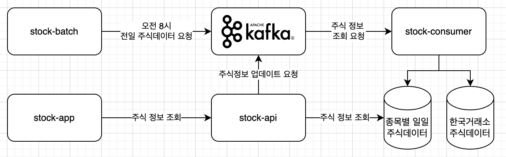

# 주식 데이터 시스템
소소하게 매일 정리하는 주가 정보를 손으로 하기 너무 귀찮다.
시스템이 알아서 해주면 좋겠다.

## 시스템 구조

1. stock-batch: 일일 주가 업데이트 요청을 메시지큐에 요청한다.
2. stock-consumer: 주식 데이터 업데이트 요청을 처리한다.
3. stock-api: 주식 데이터 조회/업데이트를 위한 API 서버
4. stock-app: 주식데이터를 보여줄 수 있는 화면

## 프로젝트 구성
1. Spring boot3(Java21)
2. Kafka 3.9
3. Mysql 8.0

## 인프라 구성방법
1. mysql, kafka 구성
>[docker-compose.local.yml](./docker-compose.local.yml)

2. mysql table 생성
> [init.sql](./doc/init.sql)
