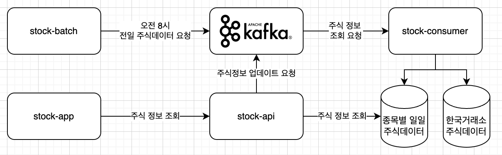

# 주식 데이터 시스템
소소하게 매일 정리하는 주가 정보를 손으로 하기 너무 귀찮다.
시스템이 알아서 해주면 좋겠다.

## 시스템 구조

1. **stock-batch**: @Scheduled 기반 주가/상장 조회 요청을 Kafka에 발행 + 재시도 큐 주기 스캔
2. **stock-consumer**: Kafka 메시지 수신 → KRX API 호출 → DB 저장. 실패 outcome은 이벤트 재시도 큐/DLQ로 관리
3. **stock-api** *(예정)*: 주식 데이터 조회/업데이트 API
4. **stock-app** *(예정)*: 주식 데이터 UI

## 프로젝트 구성

Spring Boot 3 / Java 21. 
- **헥사고날(Ports & Adapters) 멀티모듈** 구조
- 도메인 모델은 **DDD 전술 패턴**으로 설계.

```
application/                Driver adapter — Spring Boot 실행 단위
  stock-batch           @Scheduled 진입점 (producer/*)
  stock-consumer        @KafkaListener 진입점 (listener/*)
    └── service/            조합 유스케이스 — 도메인 CQRS service + port만 주입 (repository 직접 주입 금지)

domain/                     Aggregate 단위 도메인 모듈 (entity + repository + JPA/QueryDSL + CQRS service)
  market                    MarketType, MarketCalendar
  stock                     Stock, StockListedDate, TradingStatus + StockListingFetcher port
  stock-price               DailyStockPrice, StockDataChange + DailyPriceFetcher port + StockInfo
  technical-indicator       TechnicalIndicator + 지표 계산기
  krx-call-log              KrxDailyData (KRX API 호출 이력 + 감사용 audit log)
  event-retry               PendingEventRetry (재시도 큐) + FailedEvent (DLQ)

infrastructure/             Driven adapter — 외부 시스템 연결
  krx                       KRX API 어댑터 (Feign 기반 DailyPriceFetcher / StockListingFetcher 포트 구현)
  redis                     Redisson 클라이언트 설정 (외부 Redis 연결)
  distributed-lock          Redisson 기반 분산락 + 멱등 가드 AOP

library/                    도메인 무관 공통 기술
  jpa                       JpaConfig, QuerydslConfiguration, JPAQueryFactory 빈
  logging                   로깅 공통 설정 (logback)
```

### 계층 원칙

- **application**: driver adapter (@KafkaListener, @Scheduled)만. 조합 유스케이스는 application의 `service/` 패키지에 두고 **repository 직접 주입 금지**. 도메인 모듈의 Query/Command service와 port만 주입.
- **domain**: 각 aggregate가 entity + repository + QueryDSL 구현 + CQRS service(`*QueryService` / `*CommandService`)를 한 모듈에 응집.
- **infrastructure**: 외부 시스템 어댑터 (KRX, Redis, 분산락).
- **library**: 비즈니스 무관 기술 유틸.

### 이벤트 재시도 흐름

각 Fetcher 포트가 자기 `Outcome`을 nested로 소유 (Published Language). 두 소비자가 동일한 4-way 분기 패턴으로 실패 경로를 재시도 큐/DLQ에 통합. event-retry는 reason을 String으로 저장 (ACL).

```
Consumer (SaveDailyMarketDataService, StockListingSyncService)
  switch (fetcher.fetch(...))
  ├── Outcome.Success      → 도메인 저장 + 재시도 큐 정리
  ├── Outcome.Holiday      → (가격) MarketCalendar HOLIDAY / (상장) no-op + 재시도 큐 정리
  ├── Outcome.RetryLater   → PendingEventRetry enqueueOrUpdate (reason.name()으로 변환)
  └── Outcome.PermanentFail → FailedEvent escalate (reason.name()으로 변환) + 재시도 큐 정리

Batch (PendingEventRetryProcessor, 매 10분)
  PendingEventRetry.findDueItems(now)
    ├── retryCount < MAX + age < 14일 → stringKafkaTemplate.send (원본 payload 그대로 Kafka 재발행)
    └── 초과                            → FailedEvent escalate + PendingEventRetry 삭제
```

키는 `(eventType, eventKey)` 단위로 멱등 유지. `stringKafkaTemplate`(StringSerializer)을 통해 저장된 JSON payload를 재직렬화 없이 그대로 발행.

## 환경변수

모든 설정은 환경변수로 주입하며, 기본값이 있어 로컬에서는 별도 설정 없이 실행 가능하다.

| 환경변수 | 설명 | 기본값 | 비고 |
|---|---|---|---|
| `DB_HOST` | MySQL 호스트 | `127.0.0.1` | |
| `DB_PORT` | MySQL 포트 | `13306` | |
| `DB_USERNAME` | DB 사용자명 | `dove_local_test` | |
| `DB_PASSWORD` | DB 비밀번호 | `dove1234` | 운영 시 반드시 변경 |
| `KAFKA_HOST` | Kafka 브로커 호스트 | `localhost` | |
| `KAFKA_PORT` | Kafka 브로커 포트 | `9092` | |
| `KRX_API_AUTH_KEY` | 한국거래소 API 인증키 | (없음) | stock-consumer에서 필수 |
| `KRX_TARGET_MARKETS` | 스케줄러가 조회할 시장 (CSV) | `KOSPI,KOSDAQ` | stock-batch에서만 사용. 허용 값: `KOSPI`, `KOSDAQ`, `KONEX` |
| `REDIS_HOST` | Redis 호스트 | `localhost` | stock-consumer에서 사용 |
| `REDIS_PORT` | Redis 포트 | `6379` | |
| `DISTRIBUTED_LOCK_WAIT_TIME` | 분산락 대기 시간 (초) | `5` | |
| `DISTRIBUTED_LOCK_LEASE_TIME` | 분산락 임대 시간 (초) | `60` | |
| `DISTRIBUTED_LOCK_TTL_SECONDS` | 멱등성 키 TTL (초) | `86400` | 기본 24시간 |
| `LOG_LEVEL` | 로그 레벨 | `DEBUG` | DEBUG, INFO, WARN, ERROR |
| `LOG_PATH` | 로그 파일 경로 | `./logs` | 파일 로깅 활성화 시 사용 |
| `SPRING_PROFILES_INCLUDE` | 파일 로깅 활성화 | (없음) | `file` 설정 시 파일 로깅 추가 |

### 로컬 실행

[docker-compose.local.yml](./docker-compose.local.yml)로 인프라를 띄우면 기본값으로 바로 실행된다.

```bash
# 1. 인프라 실행 (Kafka 토픽은 kafka-init 컨테이너가 자동 생성)
docker compose -f docker-compose.local.yml up -d

# 2. stock-batch / stock-consumer 실행
DB_HOST=127.0.0.1 DB_PORT=13306 \
DB_USERNAME=dove_local_test DB_PASSWORD=dove1234 \
KAFKA_HOST=localhost KAFKA_PORT=9092 \
KRX_API_AUTH_KEY=<발급받은_인증키> \
LOG_LEVEL=DEBUG \
./gradlew :stock-batch:bootRun       # 또는 :stock-consumer:bootRun
```

> 파일 로깅 활성화: `SPRING_PROFILES_INCLUDE=file LOG_PATH=./logs` 추가.

### 운영 실행

[docker-compose.prod.yml.example](./docker-compose.prod.yml.example)을 복사·수정하여 사용. 환경변수는 위 표 참조.

## 쉘 스크립트

- **`kafka-init.sh`** — Kafka 토픽 초기화. `docker-compose.local.yml`의 `kafka-init` 서비스가 자동 호출. 옵션은 스크립트 헤더 참조.
- **`message_publish.sh`** — Kafka 메시지 발행 대화형 도구. `./message_publish.sh [컨테이너명] [브로커주소]`. 옵션은 스크립트 헤더 참조.